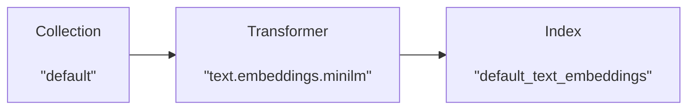
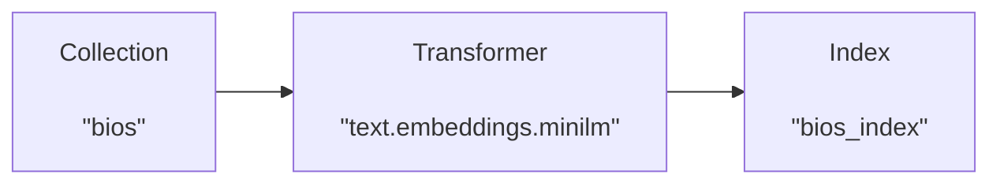

# Tutorial

## Introduction

Let's get started by instantiating the Lexy client. By default, this will connect to the Lexy server running at `http://localhost:9900`.

```python
from lexy_py import LexyClient

lexy = LexyClient()
```

We can get more information about the Lexy server by calling the `info` method. Here we see existing Collections, Indexes, Transformers, and Bindings.


```python
lexy.info()
```


```{ .text .no-copy .result #code-output }
Lexy server <http://localhost:9900/api>

2 Collections
    - <Collection('default', description='Default collection')>
    - <Collection('code', description='Github code repos')>
1 Indexes
    - <Index('default_text_embeddings', description='Text embeddings for default collection')>
2 Transformers
    - <Transformer('text.embeddings.minilm', description='Text embeddings using "sentence-transformers/all-MiniLM-L6-v2"')>
    - <Transformer('text.counter.word_counter', description='Returns count of words and the longest word')>
1 Bindings
    - <Binding(id=1, status=ON, collection='default', transformer='text.embeddings.minilm', index='default_text_embeddings')>
```


Let's add some documents to our "**default**" collection. We can add them using the `add_documents` method.


```python
lexy.add_documents([
    {"content": "This is my first document! It's great!"},
    {"content": "Starlink is a satellite internet constellation operated by American aerospace company SpaceX, providing coverage to over 60 countries."},
    {"content": "A latent space is an embedding of a set of items within a manifold in which items resembling each other are positioned closer to one another."}
])
```

```{ .text .no-copy .result #code-output }
[<Document("This is my first document! It's great!")>,
 <Document("Starlink is a satellite internet constellation operated by American aerospace company SpaceX,...")>,
 <Document("A latent space is an embedding of a set of items within a manifold in which items resembling each...")>]
```

Documents that are added to the "**default**" collection are automatically embedded, and the embeddings are stored in the index "**default_text_embeddings**".


<div style="text-align: center;">



</div>

We can query the default index for "_what is deep learning_" and see our documents ranked by cosine similarity.


```python
lexy.query_index('what is deep learning')
```

```{ .text .no-copy .result #code-output }
[{'document_id': '28dee402-31aa-4622-89e9-ce9ac06a4cf8',
  'custom_id': None,
  'meta': {},
  'index_record_id': '56c2e116-13af-4db6-ac27-68cb44f3077c',
  'content': 'A latent space is an embedding of a set of items within a manifold in which items resembling each other are positioned closer to one another.',
  'distance': 1.2856687307357788},
 {'document_id': '01e1f7ff-a890-4f6a-aeac-a0f99bdf9e77',
  'custom_id': None,
  'meta': {},
  'index_record_id': '5544c784-5e7c-4b34-bd73-dc4cbd139af6',
  'content': "This is my first document! It's great!",
  'distance': 1.3882379531860352},
 {'document_id': '449cc363-dc2b-45cf-b47e-6465af505401',
  'custom_id': None,
  'meta': {},
  'index_record_id': '9b57f1e0-de4c-4b2b-95b9-0d77af31fe2c',
  'content': 'Starlink is a satellite internet constellation operated by American aerospace company SpaceX, providing coverage to over 60 countries.',
  'distance': 1.3894593715667725,}]
```


## Example: Famous biographies

Let's go through a longer example to see how Collections, Documents, Indexes, Bindings, and Transformers interact with one another. We'll use Lexy to create and query embeddings for a new collection of documents.

### Collections

We can see that there are currently two collections, "**default**" and "**code**".


```python
lexy.collections
```


```{ .text .no-copy .result #code-output }
[<Collection('default', description='Default collection')>,
 <Collection('code', description='Github code repos')>]
```

Let's create a new "**bios**" collection for famous biographies.

```python
bios = lexy.create_collection('bios', description='Famous biographies')
bios
```


```{ .text .no-copy .result #code-output }
<Collection('bios', description='Famous biographies')>
```

### Documents

We can use the `list_documents` method to see that our new collection is empty.

```python
bios.list_documents()
```


```{ .text .no-copy .result #code-output }
[]
```


Let's add a few documents to our new collection.


```python
bios.add_documents([
    {"content": "Stephen Curry is an American professional basketball player for the Golden State Warriors."},
    {"content": "Dwayne 'The Rock' Johnson is a well-known actor, former professional wrestler, and businessman."},
    {"content": "Taylor Swift is a singer known for her songwriting, musical versatility, and artistic reinventions."}
])
```

```{ .text .no-copy .result #code-output }
[<Document("Stephen Curry is an American professional basketball player for the Golden State Warriors.")>,
 <Document("Dwayne 'The Rock' Johnson is a well-known actor, former professional wrestler, and businessman.")>,
 <Document("Taylor Swift is a singer known for her songwriting, musical versatility, and artistic reinventions.")>]
```


### Transformers

Now we want to create embeddings for the documents in our new collection. We'll use a **`Transformer`** to generate embeddings for our documents. We can use the `.transformers` property to see the available transformers.


```python
lexy.transformers
```


```{ .text .no-copy .result #code-output }
[<Transformer('text.embeddings.minilm', description='Text embeddings using "sentence-transformers/all-MiniLM-L6-v2"')>,
 <Transformer('text.counter.word_counter', description='Returns count of words and the longest word')>]
```


For our example, we'll use the "**text.embeddings.minilm**" transformer, which uses the [MiniLM sentence transformer](https://huggingface.co/sentence-transformers/all-MiniLM-L6-v2) model to generate embeddings for text.

### Indexes

Before we can bind this transformer to our collection, we need to create an **`Index`** for storing the resulting embeddings. Let's create a new index called "**bios_index**" with embeddings for our new collection. Our index will have a single field called "**bio_embedding**" that will store the embeddings output by the MiniLM sentence transformer.


```python
# define index fields
index_fields = {
    "bio_embedding": {
        "type": "embedding", "extras": {"dims": 384, "model": "text.embeddings.minilm"}
    }
}

# create index
index = lexy.create_index(index_id='bios_index', 
                          description='Biography embeddings', 
                          index_fields=index_fields)
index
```


```{ .text .no-copy .result #code-output }
<Index('bios_index', description='Biography embeddings')>
```


### Bindings

Now let's create a **`Binding`**. Our binding will feed the documents in our "**bios**" collection into the "**text.embeddings.minilm**" transformer, and insert the resulting output in our newly created index, "**bios_index**".
<br>

<div style="text-align: center;">



</div>


```python
binding = lexy.create_binding(collection_id='bios',
                              transformer_id='text.embeddings.minilm',
                              index_id='bios_index')
binding
```


```{ .text .no-copy .result #code-output }
<Binding(id=2, status=ON, collection='bios', transformer='text.embeddings.minilm', index='bios_index')>
```


Our binding automatically runs asynchronous jobs to process our documents and store the results in our index as embeddings. We can now query our index for "_famous artists_" and see the results ranked by cosine similarity.

```python
index.query(query_text='famous artists', query_field='bio_embedding', k=3)
```


```{ .text .no-copy .result #code-output }
[{'document_id': 'c1090c0f-5fb4-4e8b-af47-d3fecb1d3e11',
  'custom_id': None,
  'meta': {},
  'index_record_id': '17ea9419-790f-4143-94c9-1c43a25a13e2',
  'content': 'Taylor Swift is a singer known for her songwriting, musical versatility, and artistic reinventions.',
  'distance': 1.1270135641098022},
 {'document_id': 'b0a5e701-749d-4361-a941-b8d6ffcbfe92',
  'custom_id': None,
  'meta': {},
  'index_record_id': 'dc840614-43fc-48bc-b4a9-fedca1f5950d',
  'content': "Dwayne 'The Rock' Johnson is a well-known actor, former professional wrestler, and businessman.",
  'distance': 1.2409147024154663},
 {'document_id': '68b0bb68-fee4-4631-a5db-874a7af32b46',
  'custom_id': None,
  'meta': {},
  'index_record_id': '5b44fa50-0b08-4797-84ca-af47c2f05dff',
  'content': 'Stephen Curry is an American professional basketball player for the Golden State Warriors.',
  'distance': 1.3264542818069458}]
```


Because our binding has status set to "`ON`", any new documents added to our collection will automatically be processed by our transformer and inserted into our index.
 
Let's add another document.


```python
bios.add_documents([
    {"content": "Beyoncé is a singer and songwriter recognized for her boundary-pushing artistry, vocals, and performances."}
])
```

```{ .text .no-copy .result #code-output }
[<Document("Beyoncé is a singer and songwriter recognized for her boundary-pushing artistry, vocals, and...")>]
```


Now let's run the same query again for "_famous artists_". We can see the results have been updated and include our new document.

```python
index.query(query_text='famous artists', query_field='bio_embedding', k=3)
```


```{ .text .no-copy .result #code-output }
[{'document_id': 'c1090c0f-5fb4-4e8b-af47-d3fecb1d3e11',
  'custom_id': None,
  'meta': {},
  'index_record_id': '17ea9419-790f-4143-94c9-1c43a25a13e2',
  'content': 'Taylor Swift is a singer known for her songwriting, musical versatility, and artistic reinventions.',
  'distance': 1.1270135641098022},
 {'document_id': 'c7f51ec0-9f88-4fd7-a176-846cc6db1736',
  'custom_id': None,
  'meta': {},
  'index_record_id': 'd55753d8-33cb-4a11-9a6f-c3c4a5fe2751',
  'content': 'Beyoncé is a singer and songwriter recognized for her boundary-pushing artistry, vocals, and performances.',
  'distance': 1.1645721197128296},
 {'document_id': 'b0a5e701-749d-4361-a941-b8d6ffcbfe92',
  'custom_id': None,
  'meta': {},
  'index_record_id': 'dc840614-43fc-48bc-b4a9-fedca1f5950d',
  'content': "Dwayne 'The Rock' Johnson is a well-known actor, former professional wrestler, and businessman.",
  'distance': 1.2409147024154663}]
```


## Next steps

### Custom transformers

So far, we've only used the default transformers included in Lexy. Let's see how we can easily create our own transformers.


#### Add transformer code

Add your transformer code in a new module with the path `lexy.transformers.<your_module>`. Assuming your module is called `code`, your project should have the following structure:

```hl_lines="4"
lexy
├── transformers
    ├── __init__.py
    ├── code.py
    ├── counter.py
    └── embeddings.py
```

And your file `code.py` should look something like this:

```python title="lexy/transformers/code.py"
from lexy.models.document import Document
from lexy.transformers import lexy_transformer


def parse_code(content):
    # just an example
    return [
        {'text': 'my comment', 'line_no': 1, 'filename': 'example.py'}
    ]


@lexy_transformer(name='code.extract_comments.v1')  # (1)
def get_comments(doc: Document) -> list[dict]:
    comments = []
    for c in parse_code(doc.content):
        comments.append({
            'comment_text': c['text'],
            'comment_meta': {
                'line_no': c['line_no'],
                'filename': c['filename']
            }
        })
    return comments
```

1.  The `@lexy_transformer` decorator registers your function as a transformer. The `name` argument is the transformer 
    ID. This is how you'll refer to your transformer when creating bindings. The `name` should be unique across all 
    transformers.

#### Install optional dependencies

Make sure to install any dependencies required for your custom transformer code.

In development, you can install your dependencies using `docker exec`. This will be temporary (for the life of the 
docker container), but makes it easy to work with your packages in development.

```bash
docker exec lexy-server pip install <your_package>
docker exec lexy-celeryworker pip install <your_package>
```

In production, you'll want to update `pyproject.toml` to include your package in the list of `lexy_transformers` 
extras.

```toml hl_lines="6 9" title="pyproject.toml"
[tool.poetry.dependencies]
...
# optional dependencies
transformers = { version = "^4.33.1", extras = ["torch"], optional = true}
sentence-transformers = { version = "^2.2.2", optional = true}
<your_package> = { version = "<version>", optional = true}

[tool.poetry.extras]
lexy_transformers = ["transformers", "sentence-transformers", "<your_package>"]
```

#### Update configuration

In `lexy.core.config`, update the values for `lexy_server_transformer_imports` and `lexy_worker_transformer_imports` 
to include your new module.

```python hl_lines="6 11" title="lexy/core/config.py"
...

class GlobalConfig(BaseConfig):
    ...
    lexy_server_transformer_imports = { # (1)
		'lexy.transformers.code',
		'lexy.transformers.counter',
		'lexy.transformers.embeddings',
    }
    lexy_worker_transformer_imports = { # (2)
		'lexy.transformers.code',
		'lexy.transformers.counter',
		'lexy.transformers.embeddings',
    }
    ...
    
...
```

1.  These modules are imported by the Lexy server at startup. If the transformer requires significant resources, you 
    should omit it from this list and instead import it in the worker.
2.  These modules are imported each time a worker is created or restarted.

Then restart the Lexy server and worker for the updated configuration to take effect:

```bash
docker compose restart lexyserver lexyworker
```

#### Create transformer

Finally, create your transformer so that it's stored in the database and available to the Lexy server. You can do this 
by calling the `create_transformer` method.

```python
lexy.create_transformer(
    transformer_id='code.extract_comments.v1', 
    path='lexy.transformers.code.get_comments',
    description='Parse comments and docstrings.'
)
```

```{ .text .no-copy .result #code-output }
<Transformer('code.extract_comments.v1', description='Parse comments and docstrings')>
```

You're now ready to use your custom transformer to process documents!

### Document filters

_Coming soon._

#### Image files

_Coming soon._
