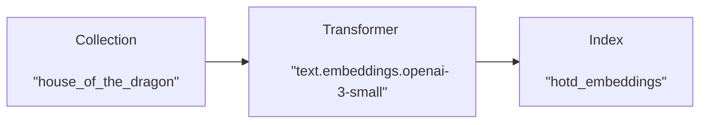

# Basic RAG using Lexy

## Introduction

Let's go through a basic implementation of Retrieval Augmented Generation (RAG) using Lexy. RAG is the process of using 
a retriever to find relevant documents to include in the prompt as context for a language model. 

In this example, we'll use Lexy to store and retrieve documents describing characters from the TV show House of the 
Dragon. We'll then use those documents to construct a prompt that GPT-4 can use to answer questions about the 
characters.

!!! example "Notebook available"
    You can find the complete code for this example in the [Lexy GitHub repository](https://github.com/lexy-ai/lexy). 
    Follow along with this tutorial using the notebook [`examples/basic_rag.ipynb`](https://github.com/lexy-ai/lexy/blob/main/examples/basic_rag.ipynb).

This tutorial is a **simplified introduction** to RAG, and not a real-world application. This is done intentionally to 
teach the basic concept of RAG and how it is implemented. We'll point out some of these simplifications as we go along, 
and discuss them in more detail in the section [Real-world considerations](#Real-world-considerations). We'll also 
provide links to additional tutorials which cover the complexities typically encountered in real-world applications.

### OpenAI API Key

This example requires an OpenAI API key in order to (1) generate embeddings, and (2) interact with 
GPT-4. Although this example uses OpenAI, you can use Lexy with any language model and any embedding model, including 
free, open-source models such as `SentenceTransformer`.

You can add your API key as an environment variable using the `.env` 
file in the root directory of the Lexy repository. See [How do I add a new environment variable](../faq.md#how-do-i-add-a-new-environment-variable) on the 
[FAQ page](../faq.md) for more details.

```shell title=".env"
OPENAI_API_KEY=your_secret_api_key
```

Remember to rebuild your containers after adding the environment variable (otherwise your container won't see the newly 
added variable). Simply run the following on the command line:

```shell
make update-dev-containers
```

Then run the following in your notebook to load the environment variables.

```python
import os
from dotenv import load_dotenv

# load environment variables, including OPENAI_API_KEY
load_dotenv()

# alternatively, you can set the environment variable directly
if "OPENAI_API_KEY" not in os.environ:
    os.environ["OPENAI_API_KEY"] = "your_secret_api_key"
```

## Sample data

Our data is in the [`sample_data/documents`](https://github.com/lexy-ai/lexy/tree/main/sample_data/documents) directory of the Lexy repo. Let's import it and take a look at the first few lines. 


```python
with open("../sample_data/documents/hotd.txt") as f:
    lines = f.read().splitlines()
    
lines[:3]
```

```{ .text .no-copy .result #code-output }
['Viserys I Targaryen is the fifth king of the Targaryen dynasty to rule the Seven Kingdoms. He is the father of Rhaenyra Targaryen and Aegon II Targaryen. His mount is the dragon Balerion.',
 'Rhaenyra Targaryen is the eldest child of King Viserys I Targaryen and is considered the heir to the Iron Throne. She is a dragonrider whose mount is Syrax.',
 'Aegon II Targaryen is the second-born child of Viserys I Targaryen and Alicent Hightower. He is a claimant to the Iron Throne and a dragonrider whose mount is Sunfyre.']
```


## Add documents to Lexy

!!! tip
    This tutorial assumes you have a basic understanding of Lexy and its core concepts. If you're new to Lexy, we recommend you start with the [Getting Started](index.md) tutorial to learn more about **Collections**, **Documents**, **Transformers**, **Indexes**, and **Bindings**.

Let's instantiate a Lexy client and create a new collection for our documents.


```python
from lexy_py import LexyClient

lexy = LexyClient()
```


```python
# create a new collection
collection = lexy.create_collection(
    collection_id="house_of_the_dragon", 
    description="House of the Dragon characters"
)
collection
```

```{ .text .no-copy .result #code-output }
<Collection('house_of_the_dragon', description='House of the Dragon characters')>
```


We can add documents to our new collection using the [`Collection.add_documents`](../reference/lexy_py/collection.md#lexy_py.collection.models.Collection.add_documents) method.


```python
collection.add_documents([
    {"content": line} for line in lines
])
```

```{ .text .no-copy .result #code-output }
[<Document("Viserys I Targaryen is the fifth king of the Targaryen dynasty to rule the Seven Kingdoms. He is...")>,
 <Document("Rhaenyra Targaryen is the eldest child of King Viserys I Targaryen and is considered the heir to...")>,
 <Document("Aegon II Targaryen is the second-born child of Viserys I Targaryen and Alicent Hightower. He is a...")>,
 <Document("Daemon Targaryen is the younger brother of King Viserys I Targaryen, and is the heir to the...")>,
 <Document("Aemond Targaryen is the second son of King Viserys I Targaryen and Alicent Hightower. He is a...")>,
 <Document("Alicent Hightower is the Queen of the Seven Kingdoms and the mother of Aegon II Targaryen, the...")>,
 <Document("Otto Hightower is the Hand of the King to Viserys I Targaryen and the father of Alicent...")>,
 <Document("Laena Velaryon is a dragonrider and the wife of Daemon Targaryen. Her mount is the dragon Vhagar.")>,
 <Document("Corlys Velaryon, also known as the Sea Snake, is the Lord of the Tides and head of House...")>,
 <Document("Rhaenys Targaryen, also known as the Queen Who Never Was, is a dragonrider and the wife of Corlys...")>,
 <Document("Syrax is the dragon ridden by Rhaenyra Targaryen. She is known for her golden scales and fierce...")>,
 <Document("Vhagar is one of the oldest and largest dragons, originally ridden by Visenya Targaryen. She...")>,
 <Document("Sunfyre is a dragon known for his magnificent golden scales and is the mount of Aegon II Targaryen.")>,
 <Document("Meleys, also known as the Red Queen, is the dragon ridden by Rhaenys Targaryen. She is known for...")>,
 <Document("Seasmoke is a dragon ridden by Laenor Velaryon, son of Corlys Velaryon and Rhaenys Targaryen. He...")>,
 <Document("Vermax is a dragon ridden by Jacaerys Velaryon, the eldest son of Rhaenyra Targaryen. He is known...")>,
 <Document("Balerion, also known as the Black Dread, was the largest of the Targaryen dragons. He was ridden...")>,
 <Document("Caraxes, also known as the Blood Wyrm, is the dragon ridden by Daemon Targaryen. He is known for...")>,
 <Document("Dreamfyre is a dragon ridden by Helaena Targaryen, the daughter of King Viserys I Targaryen. She...")>,
 <Document("Harrenhal is a massive castle in the Riverlands, known for its size and cursed history. It plays...")>,
 <Document("The Dance of the Dragons is a Targaryen civil war between the supporters of Rhaenyra Targaryen...")>]
```


## Create an Index and Binding

We'll create a binding to embed each document, and an index to store the resulting embeddings. We're going to use the OpenAI embedding model `text-embedding-3-small` to embed our documents. See the [OpenAI API documentation](https://platform.openai.com/docs/guides/embeddings) for more information on the available embedding models.


```python
# create an index
index_fields = {
    "embedding": {"type": "embedding", "extras": {"dims": 1536, "model": "text.embeddings.openai-3-small"}}
}
index = lexy.create_index(
    index_id="hotd_embeddings", 
    description="Text embeddings for House of the Dragon collection",
    index_fields=index_fields
)
```

To embed each document and store the result in our index, we'll create a 
[`Binding`](../reference/lexy_py/binding.md#lexy_py.binding.models.Binding) which connects our "**house_of_the_dragon**"
collection to our "**hotd_embeddings**" index using a 
[`Transformer`](../reference/lexy_py/transformer.md#lexy_py.transformer.models.Transformer). The 
[`LexyClient.transformers`](../reference/lexy_py/client.md#lexy_py.client.LexyClient.transformers) property shows a 
list of available transformers.


```python
# list of available transformers
lexy.transformers
```

```{ .text .no-copy .result #code-output }
[<Transformer('image.embeddings.clip', description='Embed images using 'openai/clip-vit-base-patch32'.')>,
 <Transformer('text.embeddings.clip', description='Embed text using 'openai/clip-vit-base-patch32'.')>,
 <Transformer('text.embeddings.minilm', description='Text embeddings using "sentence-transformers/all-MiniLM-L6-v2"')>,
 <Transformer('text.embeddings.openai-3-large', description='Text embeddings using OpenAI's "text-embedding-3-large" model')>,
 <Transformer('text.embeddings.openai-3-small', description='Text embeddings using OpenAI's "text-embedding-3-small" model')>,
 <Transformer('text.embeddings.openai-ada-002', description='OpenAI text embeddings using model text-embedding-ada-002')>]
```

For this example, we'll use `text.embeddings.openai-3-small`. Let's create our binding.

```python
# create a binding
binding = lexy.create_binding(
    collection_id="house_of_the_dragon",
    index_id="hotd_embeddings",
    transformer_id="text.embeddings.openai-3-small"
)
binding
```

```{ .text .no-copy .result #code-output }
<Binding(id=5, status=ON, collection='house_of_the_dragon', transformer='text.embeddings.openai-3-small', index='hotd_embeddings')>
```

Our binding was created successfully and is now active (i.e., `binding.status = ON`). Any new documents added to our 
collection will automatically be embedded and added to our index. The diagram below shows the relationship between our 
collection, transformer, and index.

<div style="text-align: center;">



</div>


## Retrieve documents

Now that our documents are embedded and those embeddings are stored in our index, we can use the 
[`Index.query`](../reference/lexy_py/indexes.md#lexy_py.index.models.Index.query) method to retrieve the most relevant 
documents for a given query. Specifically, the method returns the `k` documents that are most similar to our query 
string, as measured by **cosine similarity**. 

Let's test this out by retrieving the 2 most relevant documents for the query "parents in Westeros". 


```python
index.query(query_text="parents in Westeros", k=2)
```

```{ .text .no-copy .result #code-output }
[{'document_id': 'aaed8d7f-dd68-41dc-86f8-57b8c7b9a2d4',
  'custom_id': None,
  'meta': {},
  'index_record_id': '7ee2e437-ed91-4338-8d94-b6d20a7c7f17',
  'distance': 1.1038025617599487,
  'document.content': 'Viserys I Targaryen is the fifth king of the Targaryen dynasty to rule the Seven Kingdoms. He is the father of Rhaenyra Targaryen and Aegon II Targaryen. His mount is the dragon Balerion.'},
 {'document_id': '82eb4376-13cc-4533-bf5b-46c252be53ae',
  'custom_id': None,
  'meta': {},
  'index_record_id': 'cc796fdb-7d8a-4e9e-888d-d85f7211f343',
  'distance': 1.1070433855056763,
  'document.content': 'Alicent Hightower is the Queen of the Seven Kingdoms and the mother of Aegon II Targaryen, the second-born child of Viserys I and heir to the throne after Rhaenyra. She is the wife of Viserys I Targaryen.'}]
```


!!! info
    The `distance` field in the results shows the cosine distance between that document and the query text. The lower 
    the distance, the more similar the document is to the query text.

The documents returned by our query are profiles of Viserys Targaryen and Alicent Hightower, whose profiles specifically 
describe them as parents. Notice that none of the documents returned contain any of the exact words in the phrase 
"parents in Westeros". Yet the embedding model is able to identify these documents as being semantically similar to the 
text in our query, most likely because they contain the phrases "_...the father of..._" and "_...the mother of..._".

??? note "Note on cosine similarity"
    If you find yourself thinking that cosine similarity doesn't necessarily mean the documents are the most relevant,
    you're absolutely right! Cosine similarity is just one way to measure the similarity between two vectors. There are 
    many other ways to measure document relevance, and the best approach often depends on the specific use case.
    In future tutorials, we'll explore more advanced methods, including those that combine multiple similarity metrics.
    

## Context for GPT-4

The documents we've retrieved may not be super useful on their own, but we can provide them as context to a language model in order to generate a more informative response. Let's construct a prompt for GPT-4 to answer questions about House of the Dragon.

### Construct a prompt

With RAG, we construct our prompt **dynamically** using our retrieved documents. Given a question, we'll first retrieve the documents that are most relevant, and then include them in our prompt as context. Below is a basic template for our prompt.


```python
system_prompt = (
    "You are an exceptionally intelligent AI assistant. Answer the following "
    "questions using the context provided. PLEASE CITE YOUR SOURCES. Be concise."
)

question_template = """\
Question: 
{question}

Context:
{context}
"""
```

As an example, let's construct a prompt for the question "who is the dragon ridden by Daemon Targaryen?".


```python
# retrieve most relevant documents
question_ex = "who is the dragon ridden by Daemon Targaryen?"
results_ex = index.query(query_text=question_ex)

# format results as context
context_ex = "\n".join([
    f'[doc_id: {er["document_id"]}] {er["document.content"]}' for er in results_ex
])

# construct prompt
prompt_ex = question_template.format(question=question_ex, context=context_ex)
print(prompt_ex)
```

```{ .text .no-copy .result #code-output }
Question: 
who is the dragon ridden by Daemon Targaryen?

Context:
[doc_id: 8baa2a34-10f7-48e5-b053-1c6b8317af94] Daemon Targaryen is the younger brother of King Viserys I Targaryen, and is the heir to the throne of the Seven Kingdoms after Rhaenyra. He is a dragonrider whose mount is Caraxes.
[doc_id: a01b386d-12ad-4edb-9784-c5e0ee80d1fb] Caraxes, also known as the Blood Wyrm, is the dragon ridden by Daemon Targaryen. He is known for his red scales and fierce temperament.
[doc_id: ec5315c6-efe3-45de-82e2-16f37c563290] Syrax is the dragon ridden by Rhaenyra Targaryen. She is known for her golden scales and fierce temperament.
[doc_id: 82cf6758-049a-49c9-a4b2-155f5bf3635e] Rhaenyra Targaryen is the eldest child of King Viserys I Targaryen and is considered the heir to the Iron Throne. She is a dragonrider whose mount is Syrax.
[doc_id: d319aced-f363-4287-b034-260c6f5e5c70] Aemond Targaryen is the second son of King Viserys I Targaryen and Alicent Hightower. He is a dragonrider whose mount is Vhagar.
```

### Chat completion

Now we can use this prompt to generate a response using GPT-4. We'll use the same OpenAI client we've been using in Lexy to interact with the OpenAI API.


```python
# import OpenAI client
from lexy.transformers.openai import openai_client
```


```python
# generate response
oai_response = openai_client.chat.completions.create(
    model="gpt-4",
    messages=[
        {"role": "system", "content": system_prompt},
        {"role": "user", "content": prompt_ex}
    ]
)
print(oai_response.choices[0].message.content)
```

```{ .text .no-copy .result #code-output-textwrap }
The dragon ridden by Daemon Targaryen is Caraxes. Caraxes, also known as the Blood Wyrm, is known for his red scales and fierce temperament. 
[doc_id: 8baa2a34-10f7-48e5-b053-1c6b8317af94]
[doc_id: a01b386d-12ad-4edb-9784-c5e0ee80d1fb]
```


We can see that GPT-4 has used the context we provided to answer the question, and has specifically cited the first two documents in our search results.

!!! note "Note on GPT-4 completions"
    Keep in mind that the response from GPT-4 varies, and the responses shown here may differ from the ones 
    you'll see when running the same code. In particular, the response will often list document references in 
    inconsistent ways. If you need a more structured response, you may want to try OpenAI's 
    [JSON mode](https://platform.openai.com/docs/guides/text-generation/json-mode).

Let's put everything together into two functions: `construct_prompt` will construct a prompt given a user question, and `chat_completion` will prompt a completion from GPT-4.


```python
def construct_prompt(question: str,  
                     result_template: str = "[doc_id: {r[document_id]}] {r[document.content]}",
                     **query_kwargs):
    # retrieve most relevant results
    results = index.query(query_text=question, **query_kwargs)
    # format results for context
    context = "\n".join([
        result_template.format(r=r) for r in results
    ])
    # format prompt
    return question_template.format(question=question, context=context)

def chat_completion(message: str,
                    system: str = system_prompt, 
                    **chat_kwargs):
    # generate response
    return openai_client.chat.completions.create(
        model="gpt-4",
        messages=[
            {"role": "system", "content": system},
            {"role": "user", "content": message}
        ],
        **chat_kwargs,
    )
```


Now let's try asking GPT-4 some more questions.


```python
q = "which one is the blue dragon?"
oai_response = chat_completion(message=construct_prompt(q))
print(oai_response.choices[0].message.content)
```

```{ .text .no-copy .result #code-output-textwrap }
The blue dragon is Dreamfyre, ridden by Helaena Targaryen. She is known for her pale blue scales and graceful flight. 
[doc_id: 8aca8431-c146-4db2-a4d3-d57673fb0f7c]
```


```python
q = "who rides Vhagar?"
oai_response = chat_completion(message=construct_prompt(q))
print(oai_response.choices[0].message.content)
```

```{ .text .no-copy .result #code-output-textwrap }
Vhagar is ridden by Visenya Targaryen, Laena Velaryon, and Aemond Targaryen.
[doc_id: dc9e31bb-dfe7-429f-9275-9165c1b60c01]
[doc_id: d319aced-f363-4287-b034-260c6f5e5c70]
[doc_id: 03a84e62-bf9c-45f5-ac64-b50308b6c5fb]
```


```python
q = "who is the second son of King Viserys?"
oai_response = chat_completion(message=construct_prompt(q))
print(oai_response.choices[0].message.content)
```

```{ .text .no-copy .result #code-output-textwrap }
The second son of King Viserys I Targaryen is Aemond Targaryen. 
[doc_id: d319aced-f363-4287-b034-260c6f5e5c70]
```


```python
q = "who is the heir to the throne?"
oai_response = chat_completion(message=construct_prompt(q))
print(oai_response.choices[0].message.content)
```

```{ .text .no-copy .result #code-output-textwrap }
The heir to the throne after King Viserys I Targaryen is Rhaenyra Targaryen, who is his eldest child. Following Rhaenyra, the heir is Daemon Targaryen, the king's younger brother. Aegon II Targaryen, the second-born child of Viserys I, is also a claimant to the throne. 
[doc_id: 82cf6758-049a-49c9-a4b2-155f5bf3635e] 
[doc_id: 8baa2a34-10f7-48e5-b053-1c6b8317af94] 
[doc_id: a2418a31-870e-4876-b5b2-96eaf61b0f69]
```

## Using metadata as context

We often want to use additional metadata in our prompts to provide even more context or useful instructions to our 
language model. Let's look at an example where we might want to include document metadata when constructing our 
prompts.

First, let's ask "which is the largest Targaryen dragon?". We get the correct answer, Balerion.  


```python
q = "which is the largest Targaryen dragon?"
oai_response = chat_completion(message=construct_prompt(q))
print(oai_response.choices[0].message.content)
```

```{ .text .no-copy .result #code-output-textwrap }
The largest Targaryen dragon was Balerion, also known as the Black Dread. He was ridden by Aegon the Conqueror and King Viserys I Targaryen. 
[doc_id: 9271dfb9-c8f2-48b4-9124-e54c0e0bf725]
```


But what if we want to add new documents to our collection, and those documents contain new or contradictory 
information? In that case, we'll want to include additional metadata in our prompt which the language model can use when 
deriving an answer. 

Let's add a new document to our collection which describes a new dragon that is larger than Balerion. Because the 
binding we created earlier has status set to ON, our new document will automatically be embedded and added to our index. 
This document will be a more recent document, as measured by the value of its `updated_at` field.


```python
# add a new document
collection.add_documents([
    {"content": "Lexy was by far the largest of the Targaryen dragons, and was ridden by AGI the Conqueror."}
])
```

```{ .text .no-copy .result .wrap #code-output }
[<Document("Lexy was by far the largest of the Targaryen dragons, and was ridden by AGI the Conqueror.")>]
```


Now let's ask the same question as before, but this time we'll include the `updated_at` field in our prompt. We'll use the `return_fields` parameter to return the document's `updated_at` field along with our search results, and we'll update our `result_template` to include its value. Let's take a look at our new prompt.


```python
new_result_template = \
    "[doc_id: {r[document_id]}, updated_at: {r[document.updated_at]}] {r[document.content]}"

new_prompt = construct_prompt(
    question="which is the largest Targaryen dragon?", 
    result_template=new_result_template, 
    return_fields=["document.content", "document.updated_at"]
)
print(new_prompt)
```

```{ .text .no-copy .result #code-output }
Question: 
which is the largest Targaryen dragon?

Context:
[doc_id: 9271dfb9-c8f2-48b4-9124-e54c0e0bf725, updated_at: 2024-03-05T22:30:05.819224+00:00] Balerion, also known as the Black Dread, was the largest of the Targaryen dragons. He was ridden by Aegon the Conqueror during the War of Conquest and later by King Viserys I Targaryen.
[doc_id: c5dd2ec7-fbb8-415e-bc6b-2510e3354e74, updated_at: 2024-03-06T04:21:26.292323+00:00] Lexy was by far the largest of the Targaryen dragons, and was ridden by AGI the Conqueror.
[doc_id: 8baa2a34-10f7-48e5-b053-1c6b8317af94, updated_at: 2024-03-05T22:30:05.796365+00:00] Daemon Targaryen is the younger brother of King Viserys I Targaryen, and is the heir to the throne of the Seven Kingdoms after Rhaenyra. He is a dragonrider whose mount is Caraxes.
[doc_id: 82cf6758-049a-49c9-a4b2-155f5bf3635e, updated_at: 2024-03-05T22:30:05.788765+00:00] Rhaenyra Targaryen is the eldest child of King Viserys I Targaryen and is considered the heir to the Iron Throne. She is a dragonrider whose mount is Syrax.
[doc_id: a2418a31-870e-4876-b5b2-96eaf61b0f69, updated_at: 2024-03-05T22:30:05.793991+00:00] Aegon II Targaryen is the second-born child of Viserys I Targaryen and Alicent Hightower. He is a claimant to the Iron Throne and a dragonrider whose mount is Sunfyre.
```


We can see that our prompt now includes the `updated_at` field for each document. Now let's update our system prompt to tell GPT-4 to use the latest document when faced with conflicting information.


```python
new_system_prompt = (
    "You are an exceptionally intelligent AI assistant. Answer the following "
    "questions using the context provided. PLEASE CITE YOUR SOURCES. Be concise. "
    "If the documents provided contain conflicting information, use the most "
    "recent document as determined by the `updated_at` field."
)
```


Now let's ask GPT-4 again.


```python
q = "which is the largest Targaryen dragon?"
oai_response = chat_completion(
    message=construct_prompt(
        question=q, 
        result_template=new_result_template, 
        return_fields=["document.content", "document.updated_at"]
    ),
    system=new_system_prompt
)
print(oai_response.choices[0].message.content)
```

```{ .text .no-copy .result #code-output-textwrap }
The largest Targaryen dragon is Lexy, as indicated in the most recent document. 
[doc_id: c5dd2ec7-fbb8-415e-bc6b-2510e3354e74, updated_at: 2024-03-06T04:21:26.292323+00:00]
```

## Real-world considerations

As mentioned earlier, this tutorial is intended to teach the basics of RAG and how it's implemented. Let's briefly 
review some of the simplifications we've made. Our future tutorials will cover these topics in more detail, and 
show how Lexy helps to address them when building real-world AI applications.

- **Dataset size**: Our [sample data](https://github.com/lexy-ai/lexy/blob/main/sample_data/documents/hotd.txt) is 
  small, both in the number of documents and the size of each document. In fact, our dataset is so small that we don't 
  even need to perform retrieval; we could simply choose to include all of our documents in the prompt with each API 
  call. But in real world applications, we might have thousands or millions of documents, in which case we'll need to 
  dynamically retrieve the documents that are most relevant for a particular query.
- **Document chunking**: We've used the full text of each document as context for our language model. Documents used in 
  real-world applications will be much longer. We'll often want to break our documents up into smaller pieces (i.e., 
  chunks), and use those pieces to construct more informative prompts for our language model.
- **Multimodal data**: Our documents only contain text data. In practice, they will include other types of data 
  including images, audio, and video. We'll often want to embed and retrieve multimodal data, and to query for one 
  modality using another (e.g., search for images using audio, or search for text using video).
- **File-based documents**: Our documents consist of "free form" text. In practice, our documents may be stored as 
  external files in a variety of file formats, including PDFs, Word documents, and images. We'll often want to 
  catalogue, ingest, and process these file-based documents, and to use different parsing logic based on the file or 
  the specific application.
- **Metadata and relationships**: We've only used the `updated_at` field as an example of metadata. In the real world, 
  our document metadata will contain many more fields, including complex relationships with other documents and 
  entities. For example, we may choose to chunk and embed a function docstring, which resides in a single file of 
  Python code, which is part of a larger source code repository, which could be accessible to one or more organizations.
- **Retrieval methods**: We've used a simple cosine similarity search to retrieve documents. In a real-world 
  application, we will want to use more advanced retrieval methods, such as BM25.
- **Custom transformations**: We've used the OpenAI API to transform our text documents into vector embeddings. We may 
  want to use more advanced transformations, such as a custom (i.e., fine-tuned) embedding model, or a combination of 
  multiple Transformer models, some of which might require running your own servers.
- **Topic relevance**: In practice, one of the most difficult aspects of this type of dynamic RAG application is 
  knowing **_when_** to use it (i.e., which requests should trigger it) and **_how_** to use it (i.e., which template 
  should be populated). This is especially true in cases where the language model already contains some information on 
  the underlying topic (i.e., the information contained in our documents is part of the dataset used to train the 
  language model). This is certainly the case with our example (GPT-4 already knows about House of the Dragon, and can 
  answer our questions without the need to refer to our documents). We plan on discussing this topic as part of a 
  future blog post.


## Next steps

In this tutorial we learned how to implement Retrieval Augmented Generation (RAG) using Lexy. Specifically, we've seen 
how to use Lexy to store and retrieve documents, and how to include those documents and their metadata as context for a 
language model like GPT-4.

While this is a simple example, the basic principles are powerful. As we'll see, they can be applied to build far more 
complex AI applications. In the coming examples we'll learn:

- How to parse and store custom metadata along with our documents.
- How to use Lexy to summarize documents, and then leverage those summaries to retrieve the most relevant documents.
- How to use document filters and custom Transformers to build flexible pipelines for our data.
- How to ingest and process file-based documents (including PDFs and images) for use in our AI applications.
