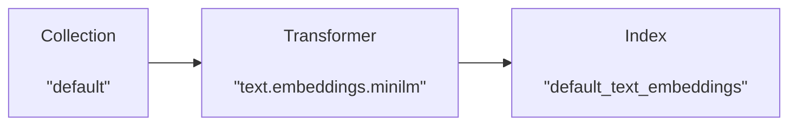
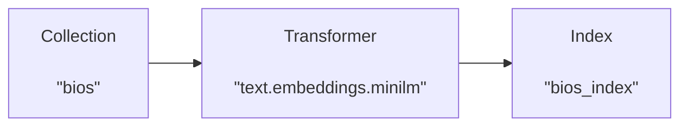

# Getting started with Lexy

## First steps

Let's get started by instantiating the Lexy client. By default, this will connect to the Lexy server running at 
`http://localhost:9900`. You can visit the OpenAPI documentation for the server at [`http://localhost:9900/docs`](http://localhost:9900/docs).

```python
from lexy_py import LexyClient

lx = LexyClient()
```

We can get more information about the Lexy server by calling the `info` method. Here we see existing Collections, Indexes, Transformers, and Bindings.


```python
lx.info()
```


```{ .text .no-copy .result #code-output }
Lexy server <http://localhost:9900/api>

2 Collections
    - <Collection('default', description='Default collection')>
    - <Collection('code', description='Github code repos')>
1 Indexes
    - <Index('default_text_embeddings', description='Text embeddings for default collection')>
6 Transformers
    - <Transformer('image.embeddings.clip', description='Embed images using 'openai/clip-vit-base-patch32'.')>,
    - <Transformer('text.embeddings.clip', description='Embed text using 'openai/clip-vit-base-patch32'.')>,
    - <Transformer('text.embeddings.minilm', description='Text embeddings using "sentence-transformers/all-MiniLM-L6-v2"')>,
    - <...additional transformers...>
1 Bindings
    - <Binding(id=1, status=ON, collection='default', transformer='text.embeddings.minilm', index='default_text_embeddings')>
```


Let's add some documents to our "**default**" collection. We can add them using the [`LexyClient.add_documents`](../reference/lexy_py/document.md#lexy_py.document.client.DocumentClient.add_documents) 
method.


```python
lx.add_documents([
    {"content": "This is my first document! It's great!"},
    {"content": "Starlink is a satellite internet constellation operated by American aerospace company SpaceX, providing coverage to over 60 countries."},
    {"content": "A latent space is an embedding of a set of items within a manifold in which items resembling each other are positioned closer to one another."}
])
```

```{ .text .no-copy .result #code-output }
[<Document("This is my first document! It's great!")>,
 <Document("Starlink is a satellite internet constellation operated by American aerospace company SpaceX,...")>,
 <Document("A latent space is an embedding of a set of items within a manifold in which items resembling each...")>]
```

Documents that are added to the "**default**" collection are automatically embedded, and the embeddings are stored in the index "**default_text_embeddings**".


<div style="text-align: center;">



</div>

We can query the default index for "_what is deep learning_" and see our documents ranked by cosine similarity.


```python
lx.query_index('what is deep learning')
```

```{ .text .no-copy .result #code-output }
[{'document_id': '28dee402-31aa-4622-89e9-ce9ac06a4cf8',
  'custom_id': None,
  'meta': {},
  'index_record_id': '56c2e116-13af-4db6-ac27-68cb44f3077c',
  'content': 'A latent space is an embedding of a set of items within a manifold in which items resembling each other are positioned closer to one another.',
  'distance': 1.2856687307357788},
 {'document_id': '01e1f7ff-a890-4f6a-aeac-a0f99bdf9e77',
  'custom_id': None,
  'meta': {},
  'index_record_id': '5544c784-5e7c-4b34-bd73-dc4cbd139af6',
  'content': "This is my first document! It's great!",
  'distance': 1.3882379531860352},
 {'document_id': '449cc363-dc2b-45cf-b47e-6465af505401',
  'custom_id': None,
  'meta': {},
  'index_record_id': '9b57f1e0-de4c-4b2b-95b9-0d77af31fe2c',
  'content': 'Starlink is a satellite internet constellation operated by American aerospace company SpaceX, providing coverage to over 60 countries.',
  'distance': 1.3894593715667725,}]
```


## Example: Famous biographies

Let's go through a longer example to see how **Collections**, **Documents**, **Indexes**, **Bindings**, and 
**Transformers** interact with one another. We'll use Lexy to create and query embeddings for a new collection of 
documents.

### Collections

We can see that there are currently two collections, "**default**" and "**code**".


```python
lx.collections
```


```{ .text .no-copy .result #code-output }
[<Collection('default', description='Default collection')>,
 <Collection('code', description='Github code repos')>]
```

Let's create a new "**bios**" collection for famous biographies.

```python
bios = lx.create_collection('bios', description='Famous biographies')
bios
```


```{ .text .no-copy .result #code-output }
<Collection('bios', description='Famous biographies')>
```

### Documents

We can use the [`Collection.list_documents`](../reference/lexy_py/collection.md#lexy_py.collection.models.Collection.list_documents) 
method to see that our new collection is empty.

```python
bios.list_documents()
```


```{ .text .no-copy .result #code-output }
[]
```


Let's add a few documents to our collection.


```python
bios.add_documents([
    {"content": "Stephen Curry is an American professional basketball player for the Golden State Warriors."},
    {"content": "Dwayne 'The Rock' Johnson is a well-known actor, former professional wrestler, and businessman."},
    {"content": "Taylor Swift is a singer known for her songwriting, musical versatility, and artistic reinventions."}
])
```

```{ .text .no-copy .result #code-output }
[<Document("Stephen Curry is an American professional basketball player for the Golden State Warriors.")>,
 <Document("Dwayne 'The Rock' Johnson is a well-known actor, former professional wrestler, and businessman.")>,
 <Document("Taylor Swift is a singer known for her songwriting, musical versatility, and artistic reinventions.")>]
```


### Transformers

Now we want to create embeddings for the documents in our new collection. We'll use a **`Transformer`** to generate 
embeddings for our documents. We can use the [`LexyClient.transformers`](../reference/lexy_py/client.md#lexy_py.client.LexyClient.transformers) property to see a list of available 
transformers.


```python
# list of available transformers
lx.transformers
```


```{ .text .no-copy .result #code-output }
[<Transformer('image.embeddings.clip', description='Embed images using 'openai/clip-vit-base-patch32'.')>,
 <Transformer('text.embeddings.clip', description='Embed text using 'openai/clip-vit-base-patch32'.')>,
 <Transformer('text.embeddings.minilm', description='Text embeddings using "sentence-transformers/all-MiniLM-L6-v2"')>,
 <Transformer('text.embeddings.openai-3-large', description='Text embeddings using OpenAI's "text-embedding-3-large" model')>,
 <Transformer('text.embeddings.openai-3-small', description='Text embeddings using OpenAI's "text-embedding-3-small" model')>,
 <Transformer('text.embeddings.openai-ada-002', description='OpenAI text embeddings using model text-embedding-ada-002')>]
```


For our example, we'll use the "**text.embeddings.minilm**" transformer, which uses the [MiniLM sentence transformer](https://huggingface.co/sentence-transformers/all-MiniLM-L6-v2) model to generate embeddings for text.

### Indexes

Before we can bind this transformer to our collection, we need to create an **`Index`** for storing the resulting 
embeddings.

Let's create a new index called "**bios_index**" with embeddings for our new collection. Our index will have a single 
field called **`bio_embedding`** that will store the embeddings output from the MiniLM sentence transformer.


```python
# define index fields
index_fields = {
    "bio_embedding": {
        "type": "embedding", "extras": {"dims": 384, "model": "text.embeddings.minilm"}
    }
}

# create index
index = lx.create_index(
    index_id='bios_index', 
    description='Biography embeddings', 
    index_fields=index_fields
)
index
```


```{ .text .no-copy .result #code-output }
<Index('bios_index', description='Biography embeddings')>
```


### Bindings

Now let's create a **`Binding`**. Our binding will:
1) Feed the documents in our "**bios**" collection into the "**text.embeddings.minilm**" transformer, then
2) Insert the resulting output in our newly created index, "**bios_index**".
<br>

<div style="text-align: center;">



</div>


```python
binding = lx.create_binding(
    collection_name='bios',
    transformer_id='text.embeddings.minilm',
    index_id='bios_index'
)
binding
```


```{ .text .no-copy .result #code-output }
<Binding(id=2, status=ON, collection='bios', transformer='text.embeddings.minilm', index='bios_index')>
```


We can now query our index for "_famous artists_" and see the results ranked by cosine similarity.

```python
index.query(query_text='famous artists', query_field='bio_embedding', k=3)
```


```{ .text .no-copy .result #code-output }
[{'document_id': 'c1090c0f-5fb4-4e8b-af47-d3fecb1d3e11',
  'custom_id': None,
  'meta': {},
  'index_record_id': '17ea9419-790f-4143-94c9-1c43a25a13e2',
  'content': 'Taylor Swift is a singer known for her songwriting, musical versatility, and artistic reinventions.',
  'distance': 1.1270135641098022},
 {'document_id': 'b0a5e701-749d-4361-a941-b8d6ffcbfe92',
  'custom_id': None,
  'meta': {},
  'index_record_id': 'dc840614-43fc-48bc-b4a9-fedca1f5950d',
  'content': "Dwayne 'The Rock' Johnson is a well-known actor, former professional wrestler, and businessman.",
  'distance': 1.2409147024154663},
 {'document_id': '68b0bb68-fee4-4631-a5db-874a7af32b46',
  'custom_id': None,
  'meta': {},
  'index_record_id': '5b44fa50-0b08-4797-84ca-af47c2f05dff',
  'content': 'Stephen Curry is an American professional basketball player for the Golden State Warriors.',
  'distance': 1.3264542818069458}]
```


Because our binding has status set to "`ON`", any new documents added to our collection will automatically be processed by our transformer and inserted into our index as embeddings.
 
Let's add another document.


```python
bios.add_documents([
    {"content": "Beyoncé is a singer and songwriter recognized for her boundary-pushing artistry, vocals, and performances."}
])
```

```{ .text .no-copy .result #code-output }
[<Document("Beyoncé is a singer and songwriter recognized for her boundary-pushing artistry, vocals, and...")>]
```


Now let's run the same query again for "_famous artists_". We can see the results have been updated and include our new document.

```python
index.query(query_text='famous artists', query_field='bio_embedding', k=3)
```


```{ .text .no-copy .result #code-output }
[{'document_id': 'c1090c0f-5fb4-4e8b-af47-d3fecb1d3e11',
  'custom_id': None,
  'meta': {},
  'index_record_id': '17ea9419-790f-4143-94c9-1c43a25a13e2',
  'content': 'Taylor Swift is a singer known for her songwriting, musical versatility, and artistic reinventions.',
  'distance': 1.1270135641098022},
 {'document_id': 'c7f51ec0-9f88-4fd7-a176-846cc6db1736',
  'custom_id': None,
  'meta': {},
  'index_record_id': 'd55753d8-33cb-4a11-9a6f-c3c4a5fe2751',
  'content': 'Beyoncé is a singer and songwriter recognized for her boundary-pushing artistry, vocals, and performances.',
  'distance': 1.1645721197128296},
 {'document_id': 'b0a5e701-749d-4361-a941-b8d6ffcbfe92',
  'custom_id': None,
  'meta': {},
  'index_record_id': 'dc840614-43fc-48bc-b4a9-fedca1f5950d',
  'content': "Dwayne 'The Rock' Johnson is a well-known actor, former professional wrestler, and businessman.",
  'distance': 1.2409147024154663}]
```


## Next steps

Check out the following tutorials to learn more about Lexy.

- [Basic RAG using Lexy](basic-rag.md) for a basic implementation of Retrieval Augmented Generation.
- [Multimodal image search](multimodal-image-search.md) for how to use Lexy to build a multimodal search engine.
- [Custom transformers](custom-transformers.md) for using your own functions as transformers.
- [Document filters](document-filters.md) shows how to build pipelines for different types of documents.
